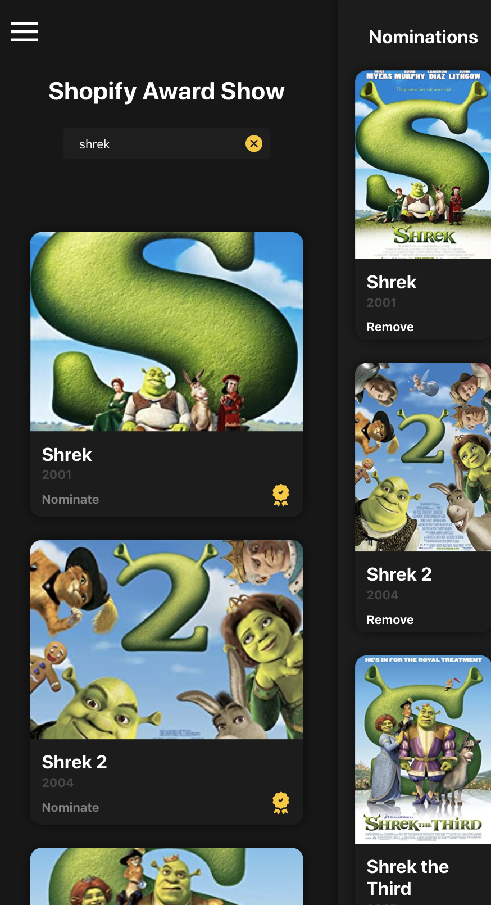

# Shopify Awards

Shopify Awards is a responsive web app build on react, typescript and firebase.

  Visit: <a href="https://shopify-challenge-f6495.web.app/">Shopify Awards</a>.
  
  **Languages**: Typescript, React

  

  
  

## Screenshots

### Desktop

  

   
  

### Mobile
  

   
  

  
  

  
  

  
## Tech stack

 - React, Typescript, Firebase
 - HTML, CSS, AdobeXD

## Contributors
  :bowtie: Steven Stapleton
